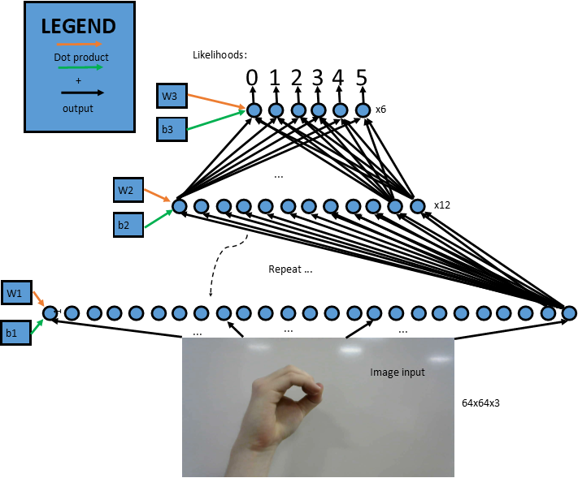

# SIMON
**SIMON** - Sign Interfaced Machine Operating Network

Neural Network Models Implemented by Jacob Cassady

**1.1 Team Members** - Jacob Cassady, Aaron Fox, Nolan Holdan, Kristi Kidd, Jacob Marcum
C and Assembly code developed by Jacob Marcum.

**1.2 Team Members** - Jacob Cassady, Patrick Chuong, Mitchel Johnson, Oscar Leon, Matthew Long

## Abstract
The purpose of the Sign-Interfaced Machine Operating Network, or SIMON, is to develop a machine learning classifier capable of detecting a discrete set of American Sign Language (ASL) presentations from captured images of a hand and producing a desired response on another system.  SIMON is capable of utilizing a variety of neural networks (nets) for producing its predictions including a classic deep neural net and a ResNet50 convolutional model.  SIMON’s neural nets were trained on 6 targets using 1200 images (200 of each representation).  The training and test sets included 1080 and 120 images respectively.  SIMON utilizes its neural nets to produce a discrete value from an image input matching the target’s class enumeration.  Images for demonstration were taken using a laptop webcam.  Predictions are represented in ASCII and are sent across a serial connection to a response machine.  This project created a response machine from a Raspberry Pi Model 3 B+, a 5050 LED light strip, and a button.   The goal of this project was to produce the correct color response from the LED light strips given an image containing an ASL representation included in our models’ training.  This goal was accomplished at its most baseline level although there were some issues and inconsistencies in the neural nets performances including differences in data distributions from training to production as well as distortions in the production data due to preprocessing techniques. SIMON was developed and tested on both Windows 10 and Ubuntu 17.

## Body
SIMON consists of two main systems.  The Xplained Mini Microcontroller which serves as the response from the image input.  And a Deep Neural Network (DNN), developed in Python on Windows 10/Ubuntu machines, leveraging the ML C library TensorFlow.  The goal of the entire system is to develop a machine-operating system which can be controlled using American Standard Sign Language (ASL).  The system receives an image and applies a classifier to determine a discrete command to send to the machine or in our case, the Xplained Mini.

To develop the DNN, notes and image samples were taken from multiple sources including Professor Andrew Ng’s Deep Learning Specialization on coursera.org.  1200 labeled images containing a white background and ASL sign representing 0, 1, 2, 3, 4, or 5 were used when training and testing the DNN.  1080 images were used for the train set and 120 were used for the test set.  As mentioned earlier, TensorFlow was used to graph the DNN.  A suggested graph structure came from Professor Ng’s course.  We developed a three-layer Neural Network with 25 nodes in the first layer, 12 nodes in the second, and 6 in the final.  Activation functions were Linear->ReLU, Linear->ReLU, and Linear->SOFTMAX respectively. The ReLU function or rectified linear unit is classically described as f(x) = max(0,x).  This was chosen over sigmoid and tanh due to its consistent slope which increases the consistency and efficiency of gradient descent.  A depiction of SIMON’s DNN can be seen below.

**SIMON Deep Neural Network Pathing Depiction**

Additionally, SIMON’s DNN makes use of regularization tactics.  First off, while training SIMON uses mini-batches.  These are randomly selected groups of images to use for training.  Our current mini-batch training size is 32.  Mini-batches increase efficiency when the batch sizes are multiples of 8.  Furthermore, it reduces the time between each update step.  Secondly, SIMON commands the TensorFlow graph to make use of an Adam Optimizer.  This combines two regularization concepts of RMSProp and Momentum.  Both of these regularization techniques make use of past gradient descent updates to smooth the direction of gradient descent and keep it moving towards the minimum cost.  Our final model produces 100% accuracy on the train set and 87.5% accuracy on the test set.

Our initial idea was to house the DNN on a Raspberry Pi 3 to ease the interface between a camera and SIMON.  After developing the system on more powerful Windows 10 and Ubuntu operating systems, we were unable to easily move the network onto the Raspberry Pi since TensorFlow does not support any distributions for the Raspbian OS.  Instead of losing the power and efficiency of TensorFlow, SIMON’s configuration has remained suitable for Windows 10, Ubuntu, or Mac OS operating systems.  Instead of using a picam as an input, we instead ask the user to select an image file which can be taken using a webcam, or any camera really.  

The Xplained Mini microcontroller served as a visual projection for the machine learning model. The MCU communicated with the neural network through USART. For each of the six discrete sign signals that were trained for the model (0-5), the model would send corresponding ASCII values to the Xplained Mini. The MCU then handled the the received ASCII value based on what mode the program was set in. For this demonstration, the MCU had two modes, “default” and “simon says”. Default was primarily for verifying the training mode of the machine learning model. Simon says would display a random integer between 0-5, and if the equivalent value was received through USART, then the program would respond with “correct”, otherwise responding with “incorrect”. The MCU utilized an LCD module to display the program interface to the user. All menu selections and mode options on the MCU were controlled through sign signals.

## References
 Microchip Technology Inc. (2018, January 3). AVR Assembler Instructions. Retrieved January
         30, 2018, from http://www.microchip.com/webdoc/avrassembler/avrassembler.wb_instru 
         ction_list.html ATmega328P Xplained Mini[PDF]. (2017). Chandler, AZ: Microchip 
         Technology, Inc

Atmel Corporation. (2016). ATmega328/P Datasheet Complete [PDF]. Atmel.

Specifications for Liquid Crystal Display[PDF]. (n.d.). AZ Displays, Inc.

ATmega328P Xplained Mini[PDF]. (2017). Chandler, AZ: Microchip Technology, Inc.

Notes for Deep Neural Network were taken from Stanford Professor Andrew Ng’s Deep Learning Specialization on coursera.org. https://www.coursera.org/specializations/deep-learning

